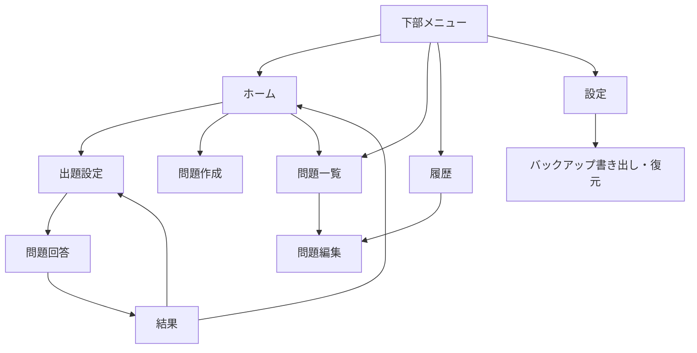

# ManaBloom FE設計書

## 1. 目的と対象

本書は、ManaBloom初期リリース版のフロントエンド構造、画面、状態、操作、表示規則を定義する。

## 2. 構成

| ファイル | 責務 |
|---|---|
| `app/page.tsx` | アプリのエントリ画面 |
| `app/QuizApp.tsx` | 画面制御、UI、学習フロー、DB操作の呼び出し |
| `app/globals.css` | 全画面のスタイル、レスポンシブ対応 |
| `app/layout.tsx` | HTMLレイアウト、メタデータ、PWA設定 |
| `app/db.ts` | データ型、IndexedDB、バックアップ処理 |
| `public/manifest.webmanifest` | PWA名、アイコン、表示形式 |
| `public/sw.js` | オフラインキャッシュ |

## 3. 画面遷移

## 4. 画面一覧

### 4.1 ホーム

- 「問題を解く」「問題をつくる」「問題一覧」を表示する。
- 今日の回答数、前回の正答率、登録問題数を表示する。
- 「まちがい復習」は表示しない。復習条件は出題設定に統合する。

### 4.2 問題一覧

- カテゴリで問題を絞り込む。
- 問題の回答方式、正答率、最終結果を表示する。
- 問題の作成、編集、削除を行う。
- カテゴリの追加と削除を行う。

### 4.3 問題作成・編集

- 共通入力: カテゴリ、問題文、回答方式。
- フリー入力: 正解文字列を入力する。
- 一文字ずつ4択: 表示用の答えと入力判定用の答えを別々に入力する。
- ○×: ○または×を正解として選択する。
- 択数回答: 2～10択、各選択肢、正解の選択肢を設定する。
- キャンセル時は、新規作成ならホーム、編集なら問題一覧へ戻る。
- 数式・関数入力と画像添付は「リリース検討中」として無効表示する。

### 4.4 出題設定

- カテゴリの初期値は「すべてのカテゴリ」とする。
- 出題範囲: すべて、前回不正解、不正解あり、未回答、苦手。
- 出題数は1問から対象問題数までスライダーで選択する。
- 制限時間は登録済み秒数から選択する。選択を解除すると制限時間なしになる。
- 秒数は1～3600秒の範囲で追加・削除できる。
- 未選択時は「選択されていないため、制限時間なしです。」と表示する。

### 4.5 問題回答

- フリー入力、○×、択数回答は「回答する」押下時に判定する。
- 一文字ずつ4択は、選択肢を押した時点で文字を追加する。
- 一文字ずつ4択は、途中で誤った文字を選択した時点、または全文字入力時点で判定する。
- 一文字ずつ4択に「1文字戻す」は表示しない。
- 正誤判定後に正解とユーザー回答を表示し、「次の問題へ」で進む。
- 制限時間を超えた場合は未回答として判定する。

### 4.6 結果

- 正答数、全問題数、正答率を表示する。
- 正答率リングは0～100%を円周全体に対して描画する。
- 各問題の正誤と、不正解時のユーザー回答・正解を表示する。

### 4.7 履歴

- 回答数、全体正答率、学習回数を表示する。
- 「日付ごと」と「回答一覧」を切り替える。
- 日付入力で特定日の履歴を選択できる。
- 履歴内の問題名を押すと問題編集画面へ遷移する。

### 4.8 設定

- データが端末内に保存されることを説明する。
- JSONバックアップを書き出す。
- JSONを読み込み、日時とデータ件数を確認後に復元する。
- 復元直前に現在データを自動バックアップする。

## 5. 状態管理

- Reactの`useState`で現在タブ、画面、編集中問題、出題条件、回答状態を管理する。
- Reactの`useMemo`で絞り込み、統計、文字選択肢を算出する。
- Reactの`useCallback`でDB再読込、回答確定、次問題遷移を安定化する。
- グローバル状態管理ライブラリは使用しない。
- 永続状態はReact stateを正とせず、IndexedDBを正とし、更新後に再読込する。

## 6. レスポンシブ・アクセシビリティ

- 760px以下ではカード、統計、履歴、フォームをスマホ向けに再配置する。
- 主要操作は`button`、入力は`label`と関連付けたフォーム要素を使用する。
- 正誤結果と通知には`role="status"`または`aria-live`を使用する。
- 削除ボタンには対象を含む`aria-label`を設定する。
- キーボード操作時も主要操作を実行できることを前提とする。

## 7. エラー表示

- 入力不足時は保存・開始・回答ボタンを無効化する。
- 重複選択肢、バックアップ形式不正、ファイルサイズ超過は画面内に表示する。
- 破壊的操作は確認ダイアログを表示する。
- 保存成功はトーストで通知する。
