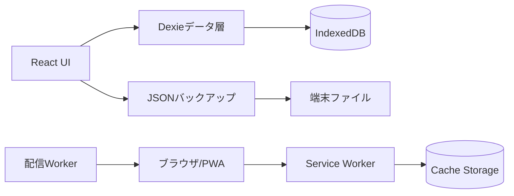

# ManaBloom BE・データ設計書

## 1. 基本方針

初期リリース版には、業務APIやサーバーDBを持つ従来型バックエンドは存在しない。ReactアプリがDexieを介してブラウザのIndexedDBへ直接読み書きする。配信側のWorkerはアプリ資材を返す責務のみを持ち、学習データを受信・保存しない。

## 2. 論理構成

## 3. IndexedDB

- DB名: `manabloom-study-db`
- 現行スキーマバージョン: 5
- 初期設定: `timeLimits = [10, 30, 60]`

### 3.1 categories

| 項目 | 型 | 必須 | 説明 |
|---|---|---|---|
| id | string | ○ | UUID、主キー |
| name | string | ○ | カテゴリ名 |
| color | string | ○ | 表示色 |
| createdAt | ISO 8601 string | ○ | 作成日時 |

索引: `id`, `name`, `createdAt`

### 3.2 questions

| 項目 | 型 | 必須 | 説明 |
|---|---|---|---|
| id | string | ○ | UUID、主キー |
| categoryId | string | ○ | カテゴリID、または`uncategorized` |
| prompt | string | ○ | 問題文 |
| answerType | enum | ○ | `text` / `letters` / `boolean` / `multiple-choice` |
| answer | string | ○ | 判定に使用する正解 |
| displayAnswer | string | - | 結果・一覧用の正解表示 |
| choices | string[] | - | 択数回答の選択肢 |
| correctChoiceIndex | number | - | 正解選択肢の位置 |
| createdAt | ISO 8601 string | ○ | 作成日時 |
| updatedAt | ISO 8601 string | ○ | 更新日時 |

索引: `id`, `categoryId`, `answerType`, `updatedAt`

### 3.3 attempts

| 項目 | 型 | 必須 | 説明 |
|---|---|---|---|
| id | string | ○ | UUID、主キー |
| questionId | string | ○ | 問題ID |
| answer | string | ○ | ユーザー回答、未回答時は空文字 |
| correct | boolean | ○ | 正誤 |
| answeredAt | ISO 8601 string | ○ | 回答日時 |
| elapsedSeconds | number | ○ | 回答所要秒数 |
| sessionId | string | ○ | 学習セッションID |

索引: `id`, `questionId`, `correct`, `answeredAt`, `sessionId`

### 3.4 sessions

| 項目 | 型 | 必須 | 説明 |
|---|---|---|---|
| id | string | ○ | UUID、主キー |
| startedAt | ISO 8601 string | ○ | 開始日時 |
| finishedAt | ISO 8601 string | ○ | 終了日時 |
| total | number | ○ | 出題数 |
| correct | number | ○ | 正答数 |

索引: `id`, `startedAt`, `finishedAt`

### 3.5 settings

| 項目 | 型 | 必須 | 説明 |
|---|---|---|---|
| key | string | ○ | 設定キー、主キー |
| numericValues | number[] | ○ | 数値設定値 |

現行キー: `timeLimits`

## 4. データ操作

- 問題保存: `questions.put`を使用し、新規・更新を共通化する。
- 回答保存: 判定直後に`attempts.add`を行う。
- セッション保存: 最終問題の結果確認後に`sessions.add`を行う。
- 問題削除: 問題と紐づく回答履歴を同一トランザクションで削除する。
- カテゴリ削除: カテゴリ、所属問題、所属問題の回答履歴を同一トランザクションで削除する。
- 復元: 全5テーブルを単一トランザクションで置換し、失敗時はロールバックする。

## 5. 正誤判定

- 基本判定は`ユーザー回答 === question.answer`の完全一致とする。
- 大文字・小文字、全角・半角、前後空白の自動正規化は行わない。
- 一文字ずつ4択は各位置の文字を比較し、誤字選択時に即時不正解とする。
- 制限時間切れは空文字の回答として不正解記録を保存する。

## 6. バックアップ仕様

- 形式: UTF-8 JSON
- 識別子: `app = "ManaBloom"`
- 形式バージョン: `version = 1`
- 上限: 読み込み時10MB
- 対象: categories、questions、attempts、sessions、settings
- ファイル名: `manabloom-backup-YYYY-MM-DD-hh-mm-ss.json`
- 復元前退避: `manabloom-before-restore-YYYY-MM-DD-hh-mm-ss.json`

読み込み時にアプリ識別子、バージョン、出力日時、配列構造、必須型、回答方式、主キー重複を検査する。検査完了後に件数を表示し、ユーザー確認後に全置換する。

## 7. オフライン・配信

- Service Workerを起動時に登録する。
- `/`、Manifest、アイコンをインストール時にキャッシュする。
- GETリクエストはネットワーク優先とし、成功レスポンスをキャッシュする。
- オフライン時はキャッシュ済みレスポンスを返し、なければ`/`へフォールバックする。
- 学習データとCache Storageは別領域であり、アプリ資材更新で学習データを削除しない。

## 8. セキュリティ・プライバシー

- 学習データをサーバーへ送信しない。
- 認証情報、個人情報、決済情報を保持しない。
- バックアップファイルは平文JSONのため、ユーザーが安全な場所で管理する。
- 復元ファイルは実行せずJSONとして解析し、10MB上限を設ける。

## 9. 将来のサーバー化

C# / ASP.NET CoreとPostgreSQLを追加する場合、カテゴリ、問題、回答、セッション、設定をAPIリソース化する。ユーザーID、認証、所有権、更新日時、削除状態、同期競合解決、APIバージョニングを追加し、IndexedDBはオフラインキャッシュおよび送信待ちキューとして再設計する。
